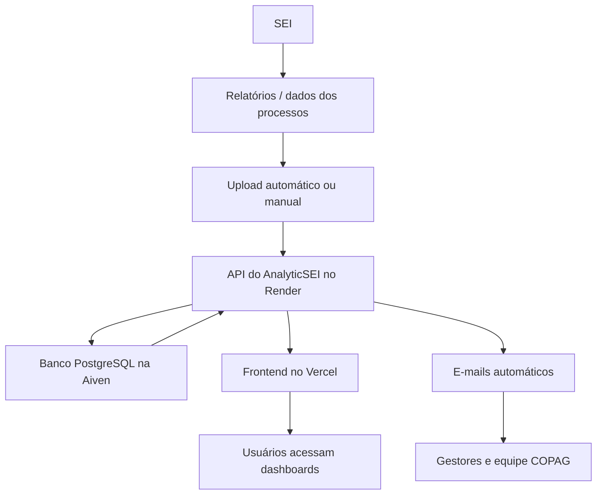

# AnalyticSEI — Documento de apresentação para a equipe

Atualizado em: 14/05/2026  
Projeto: AnalyticSEI — Painéis, indicadores e alertas para gestão de processos do SEI  
Unidade: COPAG / PROGEP / UFC  
Sistema online: https://bi-copag.vercel.app  
Repositório: https://github.com/copag-progep/bi-copag

---

## 1. Resumo executivo

O AnalyticSEI é uma plataforma criada para transformar relatórios do SEI em informação gerencial clara, visual e acionável.

Hoje, o SEI registra e organiza os processos administrativos, mas não entrega, de forma simples, respostas como:

- Quantos processos existem em cada setor?
- Quantos processos entraram e saíram hoje?
- Quais servidores estão com maior carga de processos?
- Quais processos estão parados há muitos dias?
- Quais processos aparecem em mais de um setor no mesmo dia?
- Como a produtividade evoluiu ao longo do tempo?
- Quais indicadores mensais precisam ser acompanhados pela gestão?

O AnalyticSEI foi desenvolvido para preencher essa lacuna. Ele pega os relatórios CSV exportados do SEI, organiza esses dados em um banco de dados, calcula indicadores e apresenta os resultados em dashboards, tabelas, gráficos, alertas e e-mails automáticos.

Em termos simples: o SEI é a origem operacional dos processos; o AnalyticSEI é a camada de inteligência que ajuda a gestão a enxergar volume, fluxo, produtividade, gargalos e riscos.

---

## 2. Por que o AnalyticSEI existe

Antes do AnalyticSEI, a análise dos relatórios do SEI dependia de planilhas, conferências manuais e muito trabalho repetitivo. Isso dificultava a rotina da equipe por alguns motivos:

- Os relatórios do SEI são tabelas brutas, não painéis gerenciais.
- A comparação entre dias diferentes exige cruzamento manual de dados.
- O acompanhamento de processos parados depende de cálculos de datas.
- A identificação de acúmulo por servidor ou setor exige agrupamentos manuais.
- A equipe precisava gastar tempo preparando informação antes de conseguir analisá-la.

O AnalyticSEI reduz esse esforço ao automatizar a maior parte do caminho:

1. O sistema coleta ou recebe os dados do SEI.
2. Os dados são padronizados.
3. Os registros são salvos no banco de dados.
4. Os indicadores são calculados.
5. As telas e relatórios mostram os resultados de forma visual.
6. Alertas automáticos avisam quando há situações críticas.

O objetivo não é substituir o SEI. O objetivo é complementar o SEI com visão gerencial.

---

## 3. O que o sistema entrega na prática

### Central Executiva

É a tela de decisão rápida do gestor. Ela reúne, em uma única página, os principais indicadores do dia, prioridades, saúde dos dados, tendências pequenas nos cartões e o tempo de permanência dos processos que saíram da carteira.

Essa tela foi pensada para responder rapidamente: "O que merece minha atenção agora?"

### 3.1 Dashboard executivo

É a visão geral do sistema. Mostra indicadores principais, como total de processos ativos, distribuição por setor, distribuição por tipo de processo, ranking de atribuições e evolução diária do volume de processos.

Serve para responder rapidamente: "Como está a situação geral da COPAG hoje?"

### 3.2 Entradas e saídas

Compara o relatório atual com o relatório anterior e identifica:

- Processos que entraram em cada setor.
- Processos que saíram de cada setor.
- Saldo do dia por setor.
- Evolução da carga ao longo do tempo.

Serve para entender o fluxo diário, não apenas o estoque de processos.

### 3.3 Produtividade

Analisa movimentações por atribuição/servidor, com foco em produção estimada, entradas, carga atual e evolução.

Nos gráficos, o sistema usa iniciais dos nomes para facilitar a leitura visual, mas mantém o nome completo disponível ao passar o mouse.

### Tempo de permanência / lead time

O sistema calcula o tempo estimado que os processos permaneceram em uma carteira antes de sair dela.

Em linguagem simples: se um processo apareceu nos snapshots de um setor durante vários dias e depois deixou de aparecer, o sistema entende que aquele ciclo foi finalizado naquele setor. A duração desse ciclo entra no cálculo de permanência.

Os principais indicadores dessa análise são:

| Indicador | Como interpretar |
|---|---|
| Média | Soma dos dias de permanência dividida pelo total de processos finalizados |
| Mediana | Valor central da lista; metade dos processos ficou abaixo desse tempo e metade ficou acima |
| P90 | Percentil 90; 90% dos processos foram finalizados até esse prazo e 10% demoraram mais |
| Finalizados | Quantidade de processos que saíram da carteira e entraram no cálculo |

O P90 é útil porque mostra a "cauda" do prazo. Mesmo que a média esteja boa, um P90 alto indica que existe um grupo menor de processos demorando muito mais do que os demais.

### Tendências estimadas / forecasting

A Central Executiva também mostra tendências estimadas. Elas ajudam o gestor a olhar para frente, não apenas para o retrato atual.

O sistema estima:

- Quantos processos ativos podem existir em 15 e 30 dias.
- Quais setores estão acumulando, estáveis ou resolvendo carga.
- Quantos processos podem cruzar a faixa de 30 dias se o ritmo atual se mantiver.

Essas estimativas usam regressão linear simples e histórico recente. Elas não são promessa nem previsão exata; são sinais gerenciais para orientar atenção antecipada.

Por isso, a interface usa linguagem cautelosa, como "se o ritmo atual se mantiver", e arredonda os números para evitar falsa precisão.

### Score de Risco

O Score de Risco organiza os processos por prioridade de atenção.

Ele não avalia servidores. O score é calculado sobre o processo, combinando sinais como:

- Tempo no setor.
- Tempo em relação ao histórico de permanência.
- Ausência de atribuição.
- Presença em múltiplos setores.
- Tendência do setor atual.

O objetivo é ajudar o gestor a responder: "por onde começo?". Cada processo mostra uma explicação dos fatores que contribuíram para o score.

Para evitar falsa precisão, a interface trabalha principalmente com níveis: Crítico, Elevado, Moderado e Normal. O número do score serve para ordenar processos dentro desses níveis.

### Pauta Prioritária

A Pauta Prioritária transforma o ranking de risco em acompanhamento semanal. O administrador cria uma sessão de reunião, adiciona processos críticos a partir do Score de Risco ou da tela Atribuições, atribui responsáveis e registra uma orientação.

O responsável não declara que resolveu o processo. Ele confirma ciência e pode registrar uma atualização. A resolução é detectada automaticamente pelo sistema quando, após novo upload válido, o processo deixa de constar no snapshot do setor acompanhado. Isso indica que ele foi concluído no setor ou encaminhado para fora dele.

A pauta também gera PDF para reunião, permite copiar pendências para a semana seguinte, encerra sessões com registro de auditoria e mostra métricas administrativas de eficiência.

### 3.4 Processos parados

Mostra processos com maior tempo sem movimentação inferida no setor atual. A tela usa paginação para evitar listas muito longas e facilitar a navegação.

Serve para priorizar atenção gerencial sobre processos que podem estar acumulando tempo excessivo.

### 3.5 Atribuições

Mostra a carteira de processos por atribuição, com classificação por tempo. Essa é uma das telas mais importantes para acompanhamento de carga e criticidade.

As faixas de criticidade usadas são:

| Faixa | Interpretação |
|---|---|
| Menos de 15 dias | Situação normal |
| 15 a 29 dias | Atenção |
| 30 a 44 dias | Alerta |
| 45 a 59 dias | Grave |
| 60 a 89 dias | Crítico |
| 90 dias ou mais | Extremo |

A tela permite filtros, busca e exportação em PDF ou Excel.

### 3.6 Servidores

Analisa a carga por servidor/atribuição. Ajuda a identificar concentração de processos, desequilíbrios de carga e evolução individual ao longo do tempo.

Serve para subsidiar decisões de redistribuição e acompanhamento de produtividade.

### 3.7 Múltiplos setores

Identifica processos que aparecem em mais de um setor no mesmo snapshot diário.

Isso é útil porque pode indicar tramitações simultâneas, duplicidades operacionais ou situações que merecem conferência.

### 3.8 Indicadores mensais

Permite acompanhar indicadores que não dependem apenas dos relatórios diários do SEI. A equipe pode importar planilhas ou lançar informações mensalmente.

Serve para preservar histórico e consolidar indicadores gerenciais em uma tela única.

### 3.9 Busca global

Permite localizar um processo pelo protocolo e visualizar seu histórico de movimentações registrado nos snapshots importados.

Serve para responder perguntas pontuais sobre um processo específico.

### 3.10 Administração

Área restrita a administradores. Permite gerenciar usuários e consultar o log de auditoria.

O log de auditoria registra ações críticas, como uploads, exclusões, alterações de data, criação de usuários e troca de senha.

### 3.11 Usuários SEI

Área administrativa usada para manter o "DE-PARA" de nomes do SEI.

Isso é necessário porque o mesmo servidor pode aparecer de formas diferentes nos relatórios. O sistema normaliza esses nomes para melhorar os gráficos e análises.

### 3.12 Minha conta

Permite que o usuário visualize seus dados e altere a própria senha.

---

## 4. Como os dados entram no AnalyticSEI

O AnalyticSEI trabalha com snapshots. Um snapshot é uma fotografia da situação dos processos em uma data específica.

Exemplo: se no dia 14/05/2026 o SEI informa que o setor DIAPE possui 300 processos, o AnalyticSEI salva esse retrato do dia. No dia seguinte, salva outro retrato. Comparando os dois, o sistema consegue inferir entradas, saídas, permanência e evolução.

Existem duas formas de entrada de dados.

### 4.1 Upload automático diário

De segunda a sexta, às 19:00 no horário de Fortaleza/Brasília, uma automação no GitHub Actions executa o script `scripts/sei_uploader.py`.

Esse script:

1. Acessa o SEI com as credenciais configuradas no GitHub.
2. Troca de unidade/setor dentro do SEI.
3. Coleta as páginas de processos de cada setor monitorado.
4. Gera os dados no formato esperado pelo AnalyticSEI.
5. Envia esses dados para a API do AnalyticSEI.
6. Registra o upload no sistema.

Setores monitorados atualmente:

| Setor |
|---|
| DIAPE |
| DICAT |
| DIJOR |
| DICAF |
| DICAF-CHEFIA |
| DICAF-REPOSICOES |

Se o upload automático falhar, o sistema envia e-mail de alerta com link para os logs da execução.

### 4.2 Upload manual

Na tela "Enviar Relatório", um usuário autorizado pode selecionar:

- O setor.
- A data do relatório.
- O arquivo CSV exportado do SEI.

O sistema lê o arquivo, valida o conteúdo, salva o upload e atualiza os dashboards.

Essa opção é importante para correções, reprocessamentos ou situações em que a automação não consiga rodar.

---

## 5. O que acontece após um upload

Depois que um relatório é enviado, o sistema executa uma sequência de etapas:

1. Confere se o arquivo é válido.
2. Calcula uma assinatura do arquivo para evitar duplicidade.
3. Identifica setor e data do snapshot.
4. Salva os metadados do upload.
5. Salva cada processo na tabela de processos.
6. Normaliza nomes de atribuição quando houver cadastro no DE-PARA.
7. Limpa o cache analítico.
8. Limpa o cache e pré-aquece os indicadores leves em segundo plano.
9. Atualiza telas e relatórios.
10. Registra a ação no log de auditoria.

Isso significa que o upload não é apenas "guardar um arquivo". Ele alimenta todo o sistema de indicadores.

---

## 6. Relatórios e alertas automáticos

O AnalyticSEI possui rotinas automáticas configuradas no GitHub Actions.

| Rotina | Quando roda | O que faz |
|---|---|---|
| `daily-upload` | Segunda a sexta, 19:00 BRT | Coleta dados do SEI e envia ao AnalyticSEI |
| `daily-report` | Segunda a sexta, 19:30 BRT | Confirma se o upload do dia teve sucesso e, se estiver tudo certo, envia e-mail diário compacto com principais indicadores |
| `weekly-report` | Sexta-feira, 20:00 BRT | Envia relatório semanal gerencial por e-mail |
| `critical-alerts` | Sexta-feira, 21:00 BRT | Envia alerta se houver processos críticos |
| `keep-alive` | A cada 10 minutos | Mantém a API acordada no Render |

### 6.1 Relatório diário

O relatório diário é um e-mail compacto, pensado para leitura rápida. Ele mostra:

- Total de processos ativos.
- Entradas do dia.
- Saídas do dia.
- Saldo diário.
- Situação por setor.
- Quantidade de processos acima de 30 dias.
- Quantidade de processos acima de 90 dias.
- Link para abrir a plataforma.

Ele roda às 19:30 para dar tempo de o upload automático das 19:00 terminar.

Antes de enviar, o workflow verifica se o `daily-upload` do mesmo dia concluiu com sucesso. Se o upload falhar, o relatório diário não é enviado, evitando que a equipe receba indicadores desatualizados como se fossem dados novos.

### 6.2 Relatório semanal

O relatório semanal é mais completo e gerencial. Ele consolida indicadores da semana e ajuda a olhar tendências com mais contexto.

### 6.3 Alerta de processos críticos

O alerta de processos críticos roda às sextas-feiras às 21:00.

Ele só envia e-mail se houver processos que ultrapassam o limite configurado. Isso evita excesso de mensagens quando não há problema relevante.

### 6.4 Sino de notificações dentro do sistema

No topo da plataforma há um sino de notificações. Ele mostra a quantidade de processos com 45 dias ou mais sem movimentação.

Essa é uma forma de alerta visual para quem está usando o sistema.

---

## 7. Como a plataforma funciona online

O AnalyticSEI usa quatro serviços principais na internet:

| Serviço | Papel no projeto | Explicação simples |
|---|---|---|
| GitHub | Guarda o código e executa automações | É o local onde ficam os arquivos do projeto e as rotinas programadas |
| Render | Hospeda a API/backend | É o "motor" do sistema, onde ficam as regras, cálculos e acesso ao banco |
| Vercel | Hospeda o frontend | É a parte visual acessada pelos usuários no navegador |
| Aiven PostgreSQL | Hospeda o banco de dados | É onde ficam os dados importados, usuários, uploads e histórico |

### 7.1 GitHub

O GitHub guarda o código-fonte do projeto no repositório `copag-progep/bi-copag`.

Sempre que uma alteração é enviada para o branch principal (`main`), os serviços conectados podem atualizar automaticamente.

O GitHub também executa rotinas programadas, chamadas de workflows. É por isso que o upload diário e os e-mails automáticos não dependem de alguém ligar um computador local.

### 7.2 Render

O Render hospeda o backend, que é a parte invisível do sistema para o usuário final.

O backend é responsável por:

- Receber login e senha.
- Gerar tokens de acesso.
- Receber uploads.
- Ler e gravar dados no banco.
- Calcular indicadores.
- Responder às telas do frontend.
- Servir dados para scripts de e-mail e automação.

URL da API: https://bi-copag-api.onrender.com

### 7.3 Vercel

O Vercel hospeda a parte visual do AnalyticSEI.

É o endereço que a equipe acessa no navegador:

https://bi-copag.vercel.app

O usuário interage com o frontend, mas quando clica, filtra ou consulta informações, o frontend conversa com a API no Render.

### 7.4 Aiven PostgreSQL

O Aiven hospeda o banco de dados PostgreSQL.

O banco guarda:

- Usuários da plataforma.
- Histórico de uploads.
- Processos importados.
- DE-PARA de usuários SEI.
- Indicadores mensais.
- Logs de auditoria.

O projeto antes usava Neon, mas foi migrado para Aiven após o limite gratuito de transferência de rede do Neon ser atingido. A migração preservou os dados históricos.

---

## 8. Explicação visual do fluxo



Em palavras simples:

1. O SEI é a fonte dos processos.
2. O AnalyticSEI coleta ou recebe os dados.
3. A API organiza e salva tudo no banco.
4. O frontend mostra os dados em telas amigáveis.
5. As automações enviam relatórios e alertas por e-mail.

---

## 9. O que é backend, frontend e banco de dados

Para pessoas que não são da área de tecnologia, vale entender três conceitos básicos.

### 9.1 Frontend

É a parte visual do sistema.

É aquilo que o usuário vê: telas, botões, gráficos, menus, tabelas e filtros.

No AnalyticSEI, o frontend foi feito em React e está hospedado na Vercel.

### 9.2 Backend

É a parte que trabalha por trás das telas.

Quando o usuário faz login, aplica um filtro, envia um relatório ou abre um gráfico, o frontend pede informações ao backend.

No AnalyticSEI, o backend foi feito em Python com FastAPI e está hospedado no Render.

### 9.3 Banco de dados

É o local onde as informações ficam guardadas.

No AnalyticSEI, o banco é PostgreSQL e está hospedado na Aiven.

Ele guarda tanto dados operacionais, como processos e uploads, quanto dados administrativos, como usuários e logs.

---

## 10. Principais telas do sistema

| Tela | Para que serve |
|---|---|
| Central Executiva | Visão rápida das prioridades do dia, saúde dos dados, tendências e tempo de permanência |
| Dashboard | Visão geral da situação dos processos |
| Score de Risco | Ranking de processos que merecem maior atenção, com explicação dos fatores |
| Pauta Prioritária | Lista semanal de processos críticos para acompanhamento, com responsáveis, notas, PDF de reunião e resolução automática quando o processo sai do setor |
| Enviar Relatório | Upload manual e histórico de uploads para usuários autorizados |
| Entradas e Saídas | Análise do fluxo diário por setor |
| Produtividade | Análise de produção por atribuição |
| Processos Parados | Lista de processos com maior tempo sem movimentação |
| Múltiplos Setores | Processos presentes em mais de um setor, respeitando o escopo visível do usuário |
| Atribuições | Carteira detalhada por servidor/atribuição |
| Servidores | Carga e perfil longitudinal dos servidores |
| Indicadores Mensais | Gestão de indicadores históricos filtrados por setor permitido |
| Busca | Consulta de histórico por protocolo |
| Usuários SEI | Cadastro de equivalência de nomes do SEI, aliases e vínculos por setor |
| Administração | Gestão de usuários, divisões, permissões, pesos do Score e log de auditoria |
| Minha Conta | Dados pessoais e troca de senha |
| Documentação | Documentação técnica dentro da própria plataforma |

---

## 11. Segurança e controle de acesso

O AnalyticSEI possui controle de acesso por login e senha e também por divisão. Isso permite liberar a plataforma para gestores de áreas específicas sem expor dados de todos os setores.

### 11.1 Login

Cada usuário acessa a plataforma com e-mail e senha.

Ao fazer login, o sistema gera um token temporário. Esse token funciona como uma autorização de acesso durante a sessão.

### 11.2 Senhas

As senhas não são guardadas em texto puro. O sistema guarda um hash da senha usando bcrypt.

Em termos simples: mesmo que alguém olhe o banco de dados, não verá a senha original do usuário.

### 11.3 Administradores

Algumas telas são restritas a administradores, como:

- Administração.
- Usuários SEI.
- Criação e exclusão de usuários.
- Liberação de divisões por usuário.
- Permissão para envio manual de relatórios.
- Consulta ao log de auditoria.

### 11.4 Acesso por divisão

Administradores visualizam todos os setores. Usuários comuns visualizam apenas as divisões liberadas pelo administrador.

Esse controle vale para:

- Central Executiva.
- Dashboard.
- Entradas e Saídas.
- Produtividade.
- Múltiplos Setores.
- Atribuições.
- Score de Risco.
- Servidores.
- Indicadores Mensais.
- Histórico de uploads.
- Badge de saúde dos dados.

Em termos simples: se um usuário comum tem acesso apenas a uma divisão, os números, listas, gráficos e filtros devem refletir apenas essa divisão.

### 11.5 Permissão de upload

Enviar relatórios é uma permissão separada. Um usuário comum só vê a tela "Enviar Relatório" se o administrador habilitar essa permissão.

Mesmo habilitado, ele só pode enviar relatórios dos setores aos quais possui acesso.

### 11.6 Usuários SEI vinculados a setores

A tela "Usuários SEI" permite informar em quais setores cada servidor/atribuição atua.

Isso é importante porque os filtros de "Atribuição" e "Servidor" passam a mostrar apenas nomes compatíveis com as divisões liberadas para o usuário logado.

### 11.7 Cache isolado por usuário

O sistema também separa o cache de dados por usuário. Assim, quando uma pessoa sai e outra entra no mesmo computador, a nova sessão não reutiliza dados carregados pela sessão anterior.

### 11.8 API key

As automações não usam login comum. Elas usam uma chave de API, configurada de forma secreta no GitHub e no Render.

Essa chave permite que scripts automáticos enviem dados e consultem indicadores sem depender de uma pessoa logada.

### 11.9 Log de auditoria

Ações críticas são registradas com data, usuário e detalhes.

Isso ajuda a responder perguntas como:

- Quem enviou determinado relatório?
- Quem alterou uma data de snapshot?
- Quem excluiu um upload?
- Quem criou ou alterou usuários?
- Quem alterou divisões, permissões de upload ou vínculos de usuários SEI?

---

## 12. Banco de dados em linguagem simples

O banco do AnalyticSEI é formado por tabelas principais que guardam usuários, snapshots, processos, indicadores e regras de acesso.

| Tabela | O que guarda | Exemplo de uso |
|---|---|---|
| `users` | Usuários do AnalyticSEI | Login, permissões e administradores |
| `user_sector_access` | Divisões liberadas por usuário | Define quais setores um usuário comum pode visualizar |
| `uploads` | Relatórios enviados | Histórico de arquivos importados por setor e data |
| `processos` | Linhas dos relatórios do SEI | Cada processo em cada setor e data |
| `sei_users` | Padronização de nomes | Liga variações do SEI ao nome correto do servidor |
| `sei_user_aliases` | Nomes históricos ou alternativos | Consolida mudanças de nome ou grafia |
| `sei_user_setor` | Setores por usuário SEI | Filtra listas de Atribuição e Servidor |
| `process_type_weights` | Pesos por tipo de processo | Ajusta o Score de Risco conforme prioridade do tipo |
| `pauta_sessoes` | Sessões de acompanhamento | Organiza a pauta semanal da reunião |
| `pauta_itens` | Processos priorizados na pauta | Guarda responsáveis, notas, risco e status de cada processo acompanhado |
| `monthly_stats` | Indicadores mensais | Indicadores lançados por mês e setor |
| `audit_logs` | Registro de ações críticas | Uploads, exclusões, alterações e gestão de usuários |

### 12.1 Por que guardar snapshots

O AnalyticSEI não guarda apenas "a situação atual". Ele guarda retratos de vários dias.

Isso é essencial porque permite comparar datas.

Com snapshots, o sistema consegue calcular:

- O que entrou.
- O que saiu.
- O que permaneceu.
- Quanto tempo um processo está parado.
- Como a carga evoluiu.
- Como a produtividade mudou.

Sem snapshots, haveria apenas uma foto do presente. Com snapshots, existe uma linha do tempo.

---

## 13. Como os indicadores são calculados

O sistema utiliza os dados diários para montar análises.

### 13.1 Processos ativos

São os processos presentes no snapshot de referência.

Se o usuário seleciona uma data, o sistema olha a fotografia daquela data.

### 13.2 Entradas

Um processo é considerado entrada quando aparece no snapshot atual, mas não estava no snapshot anterior daquele setor.

### 13.3 Saídas

Um processo é considerado saída quando estava no snapshot anterior, mas não aparece no snapshot atual daquele setor.

### 13.4 Saldo

Saldo é a diferença entre entradas e saídas.

Se entraram 20 processos e saíram 15, o saldo é +5.

Se entraram 10 e saíram 18, o saldo é -8.

### 13.5 Processos parados

O sistema observa por quanto tempo um processo permanece em uma mesma condição/setor/atribuição, conforme os snapshots disponíveis.

Quanto maior o tempo sem mudança inferida, maior a criticidade.

### 13.6 Produtividade estimada

A produtividade é estimada comparando snapshots. Quando um processo deixa de estar em determinada atribuição, isso pode indicar uma finalização ou movimentação daquela carteira.

Por isso o sistema fala em produção estimada. Ele infere a movimentação com base nos relatórios disponíveis.

---

## 14. Filtros e navegação

As páginas analíticas possuem filtros globais, como:

- Data de referência.
- Data inicial.
- Setor.
- Tipo de processo.
- Atribuição.

Esses filtros ajudam a responder perguntas específicas sem precisar exportar os dados para planilha.

Exemplo:

Se a gestão quiser analisar apenas a DIAPE em uma data específica, basta aplicar os filtros na tela.

---

## 15. Performance e economia de recursos

O projeto utiliza serviços gratuitos ou de baixo custo. Por isso, algumas otimizações foram aplicadas para evitar consumo excessivo.

### 15.1 Cache analítico

O backend guarda temporariamente resultados de cálculos pesados.

Isso significa que, se várias pessoas abrirem a mesma tela com os mesmos filtros, o sistema não precisa recalcular tudo do zero todas as vezes.

### 15.2 Janela padrão de histórico

Para dashboards e análises gerais, o sistema usa uma janela padrão de histórico recente, configurada por `ANALYTICS_LOOKBACK_DAYS`.

Isso reduz o volume de dados transferidos do banco e ajuda a evitar estouro de limites gratuitos.

Algumas análises que dependem do histórico completo, como processos parados, preservam o histórico integral para não distorcer o cálculo.

### 15.3 Precompute com cooldown

Após uploads, o sistema pode aquecer os cálculos em segundo plano. Para evitar várias execuções pesadas em sequência, existe um intervalo mínimo entre precomputes.

Hoje esse aquecimento roda em modo leve por padrão. Ele prioriza indicadores mais usados e evita recalcular automaticamente consultas históricas mais pesadas, como processos parados, atribuições, lead time, forecast e Score de Risco.

Se for necessário incluir esses cálculos pesados no aquecimento automático, a variável `PRECOMPUTE_HEAVY_ANALYTICS` pode ser configurada como `true` no Render. O padrão recomendado continua sendo `false`, para reduzir consumo do banco e evitar lentidão.

### 15.4 Carregamento escalonado da Central Executiva

A Central Executiva carrega primeiro os dados mais leves, como dashboard e fluxo diário. Depois busca, separadamente, processos críticos e lead time.

Isso evita que uma consulta histórica mais demorada impeça a tela inteira de abrir. Na prática, o gestor vê os principais dados primeiro e os blocos mais pesados aparecem em seguida.

### 15.5 Keep-alive leve

O Render em plano gratuito pode hibernar quando fica sem uso. Para reduzir lentidão no primeiro acesso, existe uma rotina que chama `/api/ping` a cada 10 minutos.

Esse endpoint é leve e não consulta o banco.

---

## 16. Custos e dependências externas

O projeto foi pensado para funcionar sem contratação obrigatória de infraestrutura paga.

Serviços usados:

| Serviço | Uso | Observação |
|---|---|---|
| GitHub | Código e automações | Workflows rodam em GitHub Actions |
| Render | Backend/API | Plano gratuito pode ter limitações e cold start |
| Vercel | Frontend | Hospeda a interface web |
| Aiven | Banco PostgreSQL | Plano gratuito com limites de armazenamento e uso |
| Google Workspace/Gmail | Envio de e-mails | Usa senha de app do e-mail institucional |

Ponto de atenção: serviços gratuitos têm limites. Se o uso crescer, pode ser necessário rever arquitetura, plano ou otimizações.

---

## 17. O que foi decidido sobre WhatsApp

Foi avaliada a possibilidade de envio diário por WhatsApp.

A opção oficial exigiria configuração na Meta Business / WhatsApp Cloud API, aprovação de templates e uso de infraestrutura da Meta.

Como a criação/configuração da conta Meta não avançou, a decisão atual foi manter uma solução institucional sem custo adicional: e-mail diário compacto.

Assim, o sistema permanece simples, institucional e baseado na infraestrutura que já existia no projeto.

---

## 18. Rotina operacional recomendada

### 18.1 Todos os dias úteis

- O upload automático roda às 19:00.
- O relatório diário é enviado às 19:30.
- A equipe pode consultar o dashboard no dia seguinte ou ainda no mesmo dia.

### 18.2 Semanalmente

- O relatório semanal é enviado na sexta-feira às 20:00.
- O alerta de críticos roda na sexta-feira às 21:00.

### 18.3 Quando houver falha no upload automático

Verificar:

- Se o SEI estava disponível.
- Se as credenciais do SEI continuam válidas.
- Se a API do AnalyticSEI está online.
- Se houve mudança na tela do SEI que possa afetar a automação.

Se necessário, fazer upload manual pela tela "Enviar Relatório".

### 18.4 Quando trocar o coordenador ou responsável

Atualizar no GitHub:

- `SEI_USER`
- `SEI_PASSWORD`

Essas são as credenciais usadas pelo upload automático.

Depois da troca, recomenda-se disparar manualmente o workflow `daily-upload` para testar.

---

## 19. Principais responsabilidades de manutenção

| Responsabilidade | Quem normalmente executa | Frequência |
|---|---|---|
| Acompanhar uploads automáticos | Gestão/responsável técnico | Diária |
| Conferir alertas de falha | Gestão/responsável técnico | Quando houver e-mail de falha |
| Atualizar credenciais do SEI | Responsável pela coordenação | Quando houver troca de usuário/senha |
| Manter usuários do AnalyticSEI | Administrador do sistema | Quando necessário |
| Conferir limites da Aiven/Render/Vercel | Responsável técnico | Mensal ou quando houver lentidão |
| Atualizar documentação | Responsável técnico | A cada mudança relevante |
| Validar indicadores | Equipe de gestão | Continuamente |

---

## 20. Cuidados importantes

### 20.1 Não expor credenciais

Senhas, tokens e chaves de API não devem ser colocados em documentos, prints públicos, conversas abertas ou arquivos do repositório.

Credenciais ficam em:

- GitHub Secrets.
- Variáveis de ambiente do Render.
- Painéis administrativos dos serviços.

### 20.2 Cuidado com exclusões

Excluir um upload remove os processos daquele snapshot. Essa ação deve ser feita apenas quando houver certeza de que o relatório está errado ou duplicado.

### 20.3 Conferir data do relatório

A data do snapshot é essencial. Se um relatório for enviado com data errada, os gráficos de entradas, saídas e permanência podem ficar distorcidos.

### 20.4 Serviços gratuitos têm limites

O banco já foi migrado do Neon para a Aiven após limite de transferência. Por isso, é importante monitorar consumo.

### 20.5 O AnalyticSEI depende dos dados do SEI

Se o relatório exportado/coletado do SEI estiver incompleto, o AnalyticSEI refletirá essa limitação.

---

## 21. Glossário para a equipe

| Termo | Explicação simples |
|---|---|
| BI | Business Intelligence; uso de dados para apoiar decisões |
| Dashboard | Painel visual com indicadores |
| Snapshot | Fotografia dos dados em uma data específica |
| CSV | Arquivo de tabela simples exportado pelo SEI |
| API | Canal de comunicação entre sistemas |
| Frontend | Parte visual acessada pelo usuário |
| Backend | Parte interna que processa regras e dados |
| Banco de dados | Local onde as informações ficam armazenadas |
| Deploy | Publicação de uma nova versão do sistema |
| GitHub Actions | Robôs programados que executam tarefas automaticamente |
| Render | Serviço que hospeda a API |
| Vercel | Serviço que hospeda a interface visual |
| Aiven | Serviço que hospeda o banco PostgreSQL |
| Token | Autorização temporária de acesso |
| API key | Chave secreta usada por automações |
| Cache | Memória temporária para acelerar respostas |
| Workflow | Rotina automática programada |
| DE-PARA | Tabela que padroniza nomes diferentes para uma mesma pessoa |

---

## 22. Estrutura do projeto

Esta é a estrutura principal do repositório, explicada por função.

```text
bi-copag/
├── README.md
├── Dockerfile
├── requirements.txt
├── render.yaml
├── alembic.ini
├── docs/
│   ├── AMBIENTE_LOCAL.md
│   ├── DEPLOY-MINIMO.md
│   ├── HANDOFF.md
│   └── SEI_ANALYTICS_APRESENTACAO_EQUIPE.md
├── alembic/
│   ├── env.py
│   └── versions/
│       ├── 0001_baseline.py
│       └── 0002_add_audit_logs.py
├── backend/
│   ├── main.py
│   ├── analytics.py
│   ├── auth.py
│   ├── csv_importer.py
│   ├── database.py
│   ├── models.py
│   ├── monthly_stats.py
│   ├── schemas.py
│   └── sei_users.py
├── frontend/
│   ├── package.json
│   ├── vercel.json
│   ├── vite.config.js
│   └── src/
│       ├── App.jsx
│       ├── api/
│       ├── charts/
│       ├── components/
│       ├── context/
│       ├── hooks/
│       ├── pages/
│       └── utils/
├── scripts/
│   ├── sei_uploader.py
│   ├── daily_report.py
│   ├── weekly_report.py
│   ├── alerts_email.py
│   ├── migrate_postgres.py
│   └── publish-github.ps1
└── .github/
    └── workflows/
        ├── daily-upload.yml
        ├── daily-report.yml
        ├── weekly-report.yml
        ├── critical-alerts.yml
        └── keep-alive.yml
```

### 22.1 Arquivos principais

| Caminho | Função |
|---|---|
| `backend/main.py` | Arquivo principal da API |
| `backend/analytics.py` | Cálculos dos dashboards e indicadores |
| `backend/models.py` | Definição das tabelas do banco |
| `backend/auth.py` | Login, senha, token e autenticação |
| `backend/csv_importer.py` | Importação dos relatórios CSV |
| `frontend/src/pages/` | Telas do sistema |
| `frontend/src/components/` | Componentes visuais reutilizados |
| `scripts/sei_uploader.py` | Automação de coleta/upload do SEI |
| `scripts/daily_report.py` | E-mail diário compacto |
| `scripts/weekly_report.py` | Relatório semanal |
| `scripts/alerts_email.py` | Alerta de processos críticos |
| `.github/workflows/` | Rotinas automáticas agendadas |

---

## 23. Como explicar o AnalyticSEI em uma apresentação

Uma forma simples de apresentar para a equipe:

> O AnalyticSEI é uma camada de inteligência sobre os dados do SEI. Todos os dias, ele coleta os relatórios dos setores, salva uma fotografia da situação dos processos e transforma essas informações em painéis, alertas e relatórios. Com isso, a gestão consegue acompanhar volume, fluxo, produtividade e processos críticos sem depender de planilhas manuais.

Uma explicação ainda mais curta:

> O SEI mostra os processos. O AnalyticSEI mostra a gestão dos processos.

---

## 24. Benefícios esperados para a equipe

| Benefício | Impacto prático |
|---|---|
| Menos trabalho manual | Reduz necessidade de cruzar planilhas |
| Mais transparência | Mostra situação por setor, servidor e tipo |
| Decisão mais rápida | Indicadores ficam disponíveis em painéis |
| Detecção de gargalos | Processos parados e cargas altas ficam visíveis |
| Histórico preservado | Snapshots permitem análise temporal |
| Alertas automáticos | Gestão é avisada sem precisar consultar todos os dias |
| Continuidade administrativa | Documentação e automações facilitam transição de responsáveis |

---

## 25. Limitações conhecidas

O AnalyticSEI é uma ferramenta de apoio gerencial. Algumas limitações devem ser compreendidas:

- Os indicadores dependem da qualidade dos dados exportados/coletados do SEI.
- A produtividade é inferida por comparação entre snapshots, não por confirmação manual de cada ação realizada.
- Se o SEI mudar sua interface, a automação de coleta pode precisar de ajuste.
- Serviços gratuitos podem ter limites de uso, lentidão ou indisponibilidades temporárias.
- O relatório diário às 19:30 depende do upload das 19:00; se o upload do dia não tiver sucesso, o envio é bloqueado automaticamente.
- O sistema não substitui conferência formal em casos sensíveis ou processos específicos.

---

## 26. Próximas melhorias possíveis

Sugestões que podem ser avaliadas futuramente:

- Criar destinatários separados para relatório diário e relatório semanal.
- Melhorar painéis de consumo do banco para acompanhar limites gratuitos.
- Criar tela de saúde das automações dentro do próprio AnalyticSEI.
- Adicionar indicadores de tendência semanal no e-mail diário.
- Criar rotina de backup/exportação periódica dos dados.
- Incluir controle mais detalhado de permissões por perfil de usuário.

---

## 27. Conclusão

O AnalyticSEI consolida, organiza e apresenta informações que antes ficavam dispersas em relatórios brutos do SEI e planilhas manuais.

Ele oferece uma visão diária e histórica da operação, permite acompanhar produtividade e gargalos, alerta sobre processos críticos e reduz o esforço operacional da equipe.

Mais do que uma ferramenta tecnológica, o AnalyticSEI é um instrumento de gestão. Ele ajuda a COPAG a enxergar melhor sua própria rotina, priorizar problemas, acompanhar resultados e preservar conhecimento institucional.
